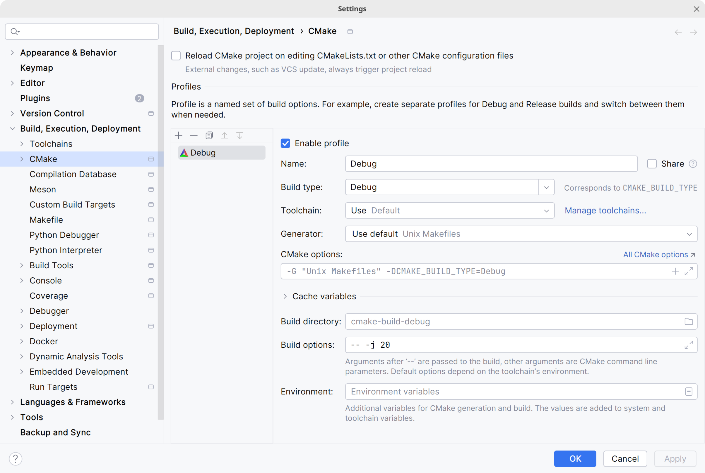
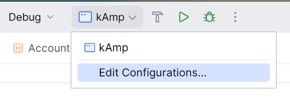
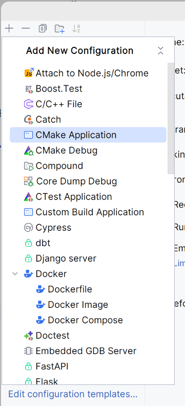
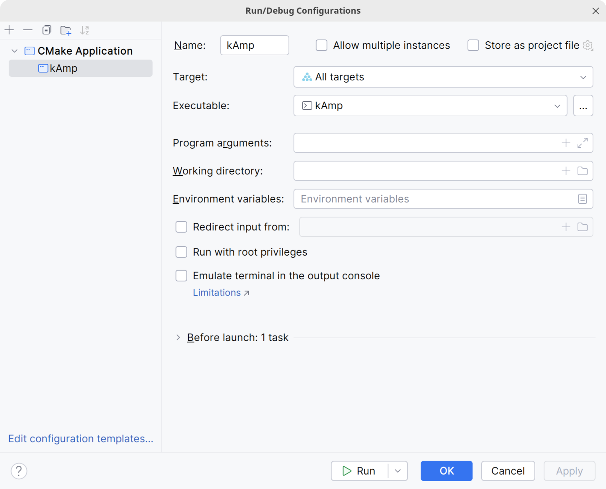

# kAmp

[](https://app.codacy.com/gh/k147-studio/kAmp/dashboard?utm_source=gh&utm_medium=referral&utm_content=&utm_campaign=Badge_grade)

## How to build

### Prerequisites

- `CMake` version 3.21 or higher
- `C++` compiler with at least support for C++17 (C++20 is recommended)

### Steps

#### Clone the repository

>Our project includes the JUCE framwework as a git submodule. You will have to use some submodule commands.

```bash
git clone https://github.com/k147-studio/kAmp.git
git submodule init
git submodule update
```

#### Install dependencies

JUCE requires a few packages that are not always installed by default on all platforms.

__Linux__

>You can find the below commands on JUCE repository via this [link](https://github.com/juce-framework/JUCE/blob/master/docs/Linux%20Dependencies.md).

```bash
# Install a C++ compiler
sudo apt update
sudo apt install g++
# Or
sudo apt install clang

# Package dependencies
sudo apt update
sudo apt install libasound2-dev libjack-jackd2-dev ladspa-sdk libcurl4-openssl-dev  libfreetype-dev libfontconfig1-dev libx11-dev libxcomposite-dev libxcursor-dev libxext-dev libxinerama-dev libxrandr-dev libxrender-dev libwebkit2gtk-4.1-dev libglu1-mesa-dev mesa-common-dev
```

__MacOS and Windows__

>Please refer to JUCE documentation and forum if you're missing dependencies.

#### Compile the project

>On every platform, we recommand to use CLion IDE which is very easy to use when it comes to CMake.

__Configure CMake on CLion__

CLion basically handles CMake pretty good natively. It will advise you about the parameters needed so there shouldn't be any problem.



On __Linux__, the defaults settings should make the job.

On __MacOS__ and __Windows__, you'll have to choose the generator that will be used to compile C++. You can relate to the list below : 
- `Xcode` on macOS
- `Unix Makefiles` on Linux
- `Visual Studio 17 2022` on Windows


__Create CMake Build Profile__

On the top-right toolbar in CLion, clik on the build menu then select "Edit Configurations". 



Then click on "+" and select "CMake Application".



You should have this window :



After that, as __Target__, select "All targets".

On __Linux__, this should be enough; if it is not the case, try to set the __CMakeLists.txt__ file at the repository root as the __Executable__. 

If it still doesn't work or you are using another platform than linux, please refer to JetBrains official [CMake documentation](https://www.jetbrains.com/help/clion/quick-cmake-tutorial.html).

Here is an example of how to build the project using `Xcode` on macOS:

```bash
mkdir build
cd build
cmake .. -G "Xcode"
cmake --build .
```
